# 국내 자동차 시장 트렌드 분석 대시보드

현대/기아 자동차 모델을 기반으로 **판매량**, **관심도(네이버·구글)**, **보급률**,  
그리고 **블로그 워드클라우드 분석**을 통합적으로 보여주는 데이터 대시보드 프로젝트입니다.

본 프로젝트는 다양한 Raw 데이터를 자동·반자동 수집하여  
정규화 → DB 적재 → 대시보드 시각화까지 전 과정을 구현합니다.

---

# 팀 정보

SKN 22기 1st 3Team '제로백' — 국내 자동차 시장 분석 프로젝트

- 최정환(BMW 3GT) : 빠르지는 않지만 늦어도 오래 멀리 갈수 있는 가성비 좋은 녀석입니다.
- 안민제(Hummer H1) : 적응이 빠른 굿 스터프 나이스 가이입니다.
- 장세환(테슬라 Model-X) : 사용자가 원하는 사항을 빠르게 파악하여 업데이트 하겠습니다.
- 엄형은(포드 머스탱) : 연비에 쩔쩔 맬거였으면 어차피 고르지 않았을 차.
- 임도형(포르쉐 911) : 승차감이 좋은 럭셔리 차입니다.

---

# 프로젝트 개요

### ✔️ 주요 기능

- **월간 판매량 분석 (다나와)**
- **검색량 기반 관심도 분석 (네이버 데이터랩 + 구글 트렌드)**
- **보급률 / 점유율 분석**
- **모델별 상세 분석 페이지**
- **블로그 상위 3개 글 텍스트 분석 + 워드클라우드 자동 생성**
- **Streamlit 기반 대시보드 UI**

### ✔️ 프로젝트 구조 (요약)

```
src/
  db/                # DB 연결
  etl/               # 데이터 정제 및 적재
  dashboard/         # Streamlit 앱
data/
  raw/               # 원본 데이터
  processed/         # 정규화 데이터 / 워드클라우드 결과
docs/                # 문서 및 정리자료
```

---

# Tech Stack

## Backend / ETL


## Database


## Dashboard / Visualization


---

# 시장 트렌드 분석 기준

용어 정리를 일부 발췌해서 설명합니다.

### 1) 관심도 점수

> 0.7 × 네이버 검색량 비중
> \+ 0.3 × 구글 트렌드 지수  
>  (구글 데이터가 없으면 네이버 검색량 비중만 사용)

---

### 2) 보급률 (Adoption Rate)

> 보급률(%) =  
> (해당 모델의 월 판매량 ÷ 같은 기간 전체 시장 판매량) × 100

---

### 3) 블로그 여론 데이터

> 네이버 검색 결과 상위 3개 블로그 글의 본문을 수집한 뒤,  
> 명사 기반 NLP 토큰화 → 키워드 빈도 계산 → 워드클라우드로 시각화한 것.

즉, 본 프로젝트는 **시장 트렌드 분석 = 관심도 vs 보급률**을 계산하기 위한 과정과, 이를 시각화하여 비교하기 쉽게 하는 것을 목표로 합니다.

---

# ER-Diagram

```mermaid
erDiagram
    CAR_MODEL {
        int model_id PK
        int danawa_model_id
        string brand_name
        string model_name_kr
        string danawa_model_url
        datetime created_at
        datetime updated_at
    }

    CAR_MODEL_IMAGE {
        int image_id PK
        int model_id FK
        string image_url
        string local_path
        string content_type
        blob image_binary
        boolean is_primary
        datetime created_at
    }

    MODEL_MONTHLY_INTEREST {
        int id PK
        int model_id FK
        date month
        int naver_search_index
        int google_trend_index
        int danawa_pop_rank
        int danawa_pop_rank_size
        datetime created_at
    }

    MODEL_MONTHLY_SALES {
        int id PK
        int model_id FK
        date month
        int sales_units
        int market_total_units
        float adoption_rate
        string source
        datetime created_at
    }

    MARKET_MONTHLY_SUMMARY {
        int id PK
        date month
        string region_code
        string vehicle_type
        string segment
        string fuel_type
        int registration_count
        string source
        datetime created_at
    }

    BLOG_ARTICLE {
        int article_id PK
        int model_id FK
        date month
        string search_keyword
        int rank
        string title
        string url
        string summary
        string content_plain
        datetime posted_at
        datetime collected_at
    }

    BLOG_TOKEN_MONTHLY {
        int id PK
        int model_id FK
        date month
        string token
        int total_count
        int rank
        datetime created_at
    }

    BLOG_WORDCLOUD {
        int id PK
        int model_id FK
        date month
        string image_path
        datetime generated_at
    }

    CAR_MODEL ||--o{ CAR_MODEL_IMAGE : "1:N"
    CAR_MODEL ||--o{ MODEL_MONTHLY_INTEREST : "1:N"
    CAR_MODEL ||--o{ MODEL_MONTHLY_SALES : "1:N"
    CAR_MODEL ||--o{ BLOG_ARTICLE : "1:N"
    CAR_MODEL ||--o{ BLOG_TOKEN_MONTHLY : "1:N"
    CAR_MODEL ||--o{ BLOG_WORDCLOUD : "1:N"
```



---

# ETL 플랜 요약

> 순서 및 자세한 플랜은 docs/etl_planning.md를 참조하세요.

### 1) Data Collecting (Raw)

- 다나와 판매량 크롤링 (Selenium)
- 네이버 데이터랩 검색지수 API
- 구글 트렌드 수동 스크래핑 데이터
- 네이버 블로그 검색 → 상위 3개 글 텍스트 크롤링

### 2) Data Normalization

- 월 기준 단위로 변환
- Model ID 매핑
- tokenization (명사 추출)
- 워드클라우드 이미지 생성

### 3) Load to DB

- 정규화된 데이터 → MySQL 적재
- ETL 별 로더 (Sales / Interest / Blog / Tokens)

### 4) Streamlit 대시보드

- Overview 페이지
- 관심도 분석
- 보급률 분석
- 상세 분석(타임라인 + 블로그 스냅샷)
- Admin 페이지(ETL 트리거용)

---

# 페이지 구성

### 01_Overview.py

최신 월 기준 KPI, 판매량 vs 관심도 TOP N, 선택 모델 상세 요약, 블로그 워드클라우드를 한 화면에서 보여준다.

### 02\_관심도 분석.py

네이버/구글 관심도 기반으로 모델별 인기와 디바이스·성별 상세 지표를 비교한다.

### 03\_보급률 분석.py

다나와 판매량/보급률 데이터를 바탕으로 Top N 모델과 RAW 테이블을 확인한다.

### 04\_상세 분석.py

특정 모델을 선택해 기간별 판매/관심도 추이와 블로그 데이터를 종합적으로 확인한다.

### 05\_시장 포지션.py

판매량·보급률·관심도(네이버+구글)를 결합한 포지션 맵을 시각화한다.

### 99_admin.py

ETL 상태 모니터링, 테이블 카운트/최신 월 확인, ETL 스크립트 수동 실행 UI 제공.

---

# 실행 방법

### 1. 환경 구성

.env를 생성하여 환경 변수를 먼저 설정해주세요. <br>
DB connection 정보와 네이버 API 클라이언트 정보가 필요합니다.

```bash
conda activate project1
pip install -r requirements.txt
```

### 2. DDL Import

```bash
mysql -u root -p < docs/init_schema.sql
```

### 3. 대시보드 실행

```bash
cd src/dashboard
streamlit run Main.py
```

---

25-11-17
